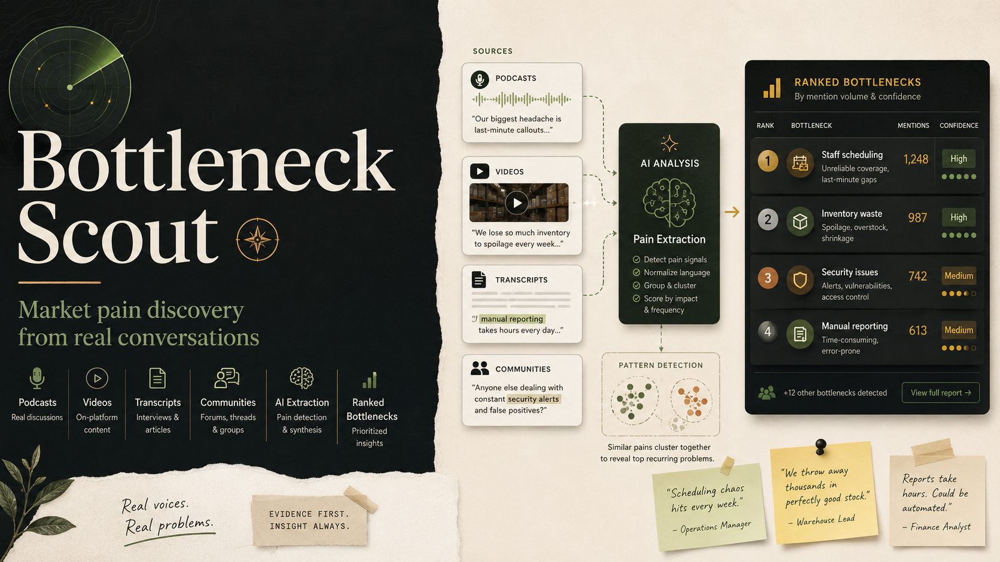
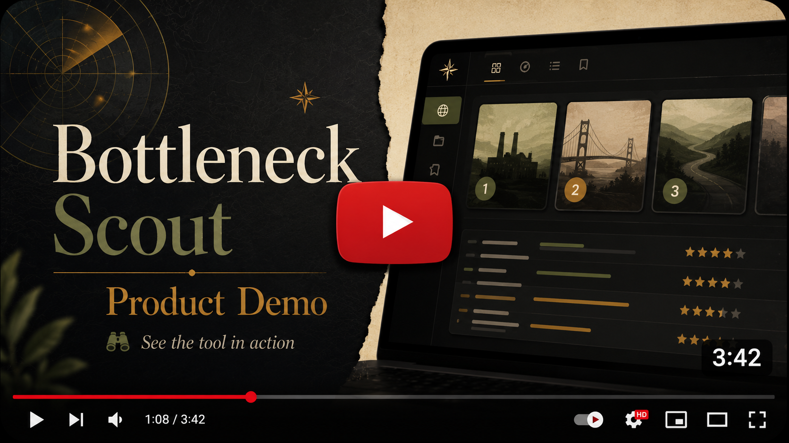
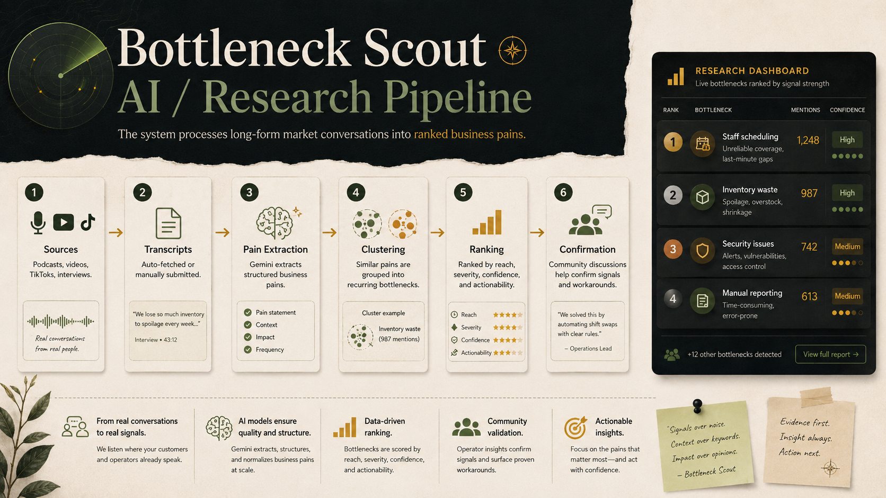
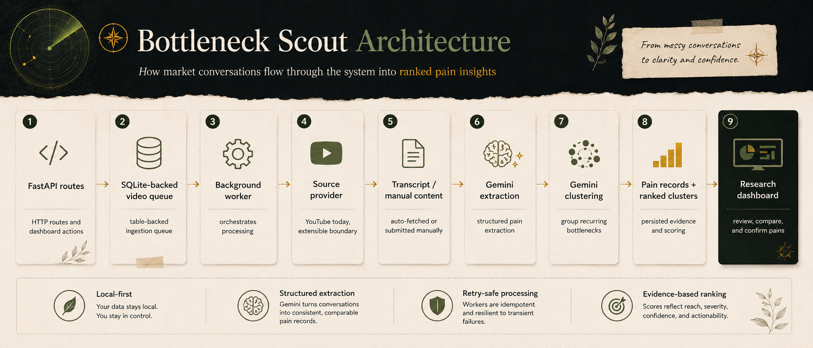

# Bottleneck Scout

A local research tool for discovering recurring business pains from long-form market conversations.

Bottleneck Scout helps turn podcasts, interviews, YouTube videos, TikToks, and manual transcripts into a ranked map of real problems people repeatedly mention in a specific market or niche.

Instead of starting from assumptions, the tool helps identify where the market is already complaining.



---

## Demo

<a href="https://youtu.be/2aMdXJP6Rus"></a>

---

## Overview

Most business ideas start with a guess.

Bottleneck Scout was built to make the first research step more evidence-driven: collect real conversations from a market, extract the pains people describe, group similar complaints, and rank the bottlenecks by recurrence, severity, confidence, and commercial potential.

Example:

```text
Topic: Restaurant owners

Input:
- 10 podcast episodes with restaurant owners
- YouTube interviews
- TikTok videos
- Reddit confirmation search

Output:
- Ranked pain clusters
- Supporting quotes
- Number of sources mentioning each pain
- Severity and confidence scores
- Reddit confirmation signals
- Potential workarounds or unsolved gaps
```

The goal is not to replace customer interviews.

The goal is to find better questions, better markets, and better pain hypotheses before building.

---

## What It Does

Bottleneck Scout lets you create a research topic and feed it with market conversations.

It then processes the content and extracts recurring business pains.

Core capabilities:

* Create research topics for markets or niches.
* Add YouTube videos for automatic transcript processing.
* Add TikTok or other video sources through manual transcript submission.
* Fetch transcripts when available.
* Fall back to manual transcript input when captions are unavailable.
* Extract structured pain points from long-form transcripts.
* Cluster similar pains into recurring bottlenecks.
* Rank pain clusters by reach, severity, confidence, and commercial actionability.
* Confirm pain signals through Reddit search and discussion analysis.
* Keep processing idempotent, so retries do not double-count previous results.

---

## Example Use Case

Research topic:

```text
Restaurant owners
```

Input sources:

```text
- Podcast episodes with restaurant owners
- YouTube interviews about restaurant operations
- TikTok videos about restaurant management
- Manual transcripts from founder interviews
- Reddit discussions from restaurant owner communities
```

Possible extracted pain clusters:

```text
1. Staff scheduling chaos
2. Food waste and inventory control
3. Security camera blind spots
4. Delivery app margin pressure
5. Manual financial reconciliation
```

If 5 out of 10 sources mention security issues, the pain is ranked higher because it appears across multiple independent conversations.

The Reddit confirmation layer can then help check whether the same pain appears in public discussions, whether people have found workarounds, and whether the problem still seems unresolved.

---

## AI / Research Pipeline



The tool processes long-form conversations offline and stores the results locally.

---

## Pain Extraction

Each transcript is analyzed with a structured prompt that asks the model to identify business pains, operational bottlenecks, complaints, workarounds, and repeated frustrations.

The output is stored as structured JSON instead of free-form text.

Each extracted pain can include:

* pain title
* description
* source quote or supporting evidence
* affected role or persona
* severity
* confidence
* market relevance
* commercial actionability

This makes the output easier to sort, cluster, review, and debug.

---

## Clustering and Ranking

After extraction, similar pains are grouped into clusters.

The ranking logic is based on signals such as:

| Signal                   | Meaning                                                                        |
| ------------------------ | ------------------------------------------------------------------------------ |
| Reach                    | How many sources mention this pain                                             |
| Severity                 | How painful or costly the issue appears                                        |
| Confidence               | How clearly the pain is supported by transcript evidence                       |
| Commercial actionability | Whether the pain suggests a possible product, service, or workflow improvement |

This avoids treating every extracted complaint equally.

A pain mentioned once in passing should not outrank a pain described repeatedly across multiple sources.

---

## Architecture



The project is intentionally small and local-first.

It uses a simple table-backed queue instead of external infrastructure, which keeps the system easy to run, inspect, and modify.

---

## Stack

| Layer            | Technology                                    |
| ---------------- | --------------------------------------------- |
| Backend          | FastAPI                                       |
| Database         | SQLite                                        |
| UI               | Jinja templates                               |
| Worker           | In-process background worker                  |
| AI extraction    | Gemini                                        |
| Source ingestion | YouTube transcripts + manual transcript input |
| Tests            | pytest                                        |
